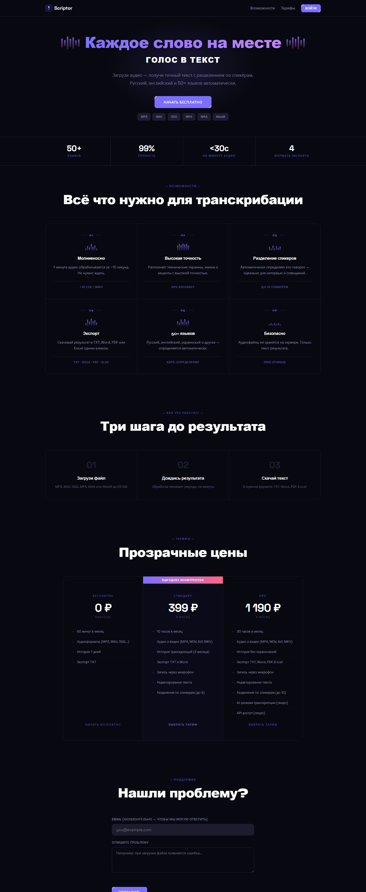

# Scriptor — SaaS для транскрибации аудио в текст

Веб-сервис распознавания речи: пользователь загружает аудио или видео (либо даёт ссылку на YouTube),
получает текст с таймкодами и выгружает его в DOCX, PDF или XLSX.

Проект сделан сольно от идеи до продакшена: архитектура, бэкенд, фронтенд, приём платежей,
рассылки, админ-панель, деплой и подключение домена. Работал под доменом getscriptor.ru,
на данный момент остановлен по экономическим причинам — репозиторий опубликован как портфолио.



## Стек

| Слой | Технологии |
|---|---|
| Бэкенд | Python, FastAPI, SQLAlchemy 2.0, Uvicorn |
| База данных | PostgreSQL (продакшен), SQLite (локальная разработка) |
| Распознавание речи | AssemblyAI API |
| Авторизация | JWT (python-jose), хеширование паролей bcrypt/passlib |
| Платежи | ЮKassa API — создание платежа, webhook, проверка статуса |
| Почта | Resend (SMTP) — подтверждение регистрации, уведомления |
| Экспорт | python-docx, fpdf2, openpyxl |
| YouTube | yt-dlp |
| Фронтенд | HTML, CSS, vanilla JavaScript (без фреймворков) |
| Инфраструктура | Railway, собственный домен, ручной деплой |

## Что реализовано

**Транскрибация**
- Загрузка аудио и видео (mp3, wav, m4a, mp4, mov, avi, mkv), до 200 МБ
- Транскрибация по ссылке на YouTube, включая Shorts и embed-ссылки
- Разбивка текста по спикерам и таймкодам
- Редактирование результата в браузере
- Экспорт в DOCX, PDF, XLSX, TXT

**Аккаунты и тарифы**
- Регистрация, JWT-авторизация, гостевой режим без регистрации
- Три тарифа с разными лимитами минут в месяц и глубиной хранения истории
- Помесячный учёт израсходованных минут, проверка квоты перед запуском задачи

**Платежи**
- Интеграция с ЮKassa: создание платежа, редирект, обработка `payment.succeeded` и `payment.canceled`
- Webhook не доверяет содержимому уведомления — статус перепроверяется отдельным запросом к API ЮKassa
- Апгрейд тарифа пользователя после подтверждения оплаты

**Админ-панель**
- Статистика по пользователям, транскрибациям и выручке
- Ручное управление тарифами и верификацией пользователей
- Просмотр логов ошибок, сбор обратной связи
- Флаг внутренних аккаунтов, чтобы тестовые данные не попадали в статистику

## Архитектура

```
backend/
├── main.py       # FastAPI: роуты, транскрибация, экспорт, админка, middleware логирования ошибок
├── database.py   # SQLAlchemy-модели: User, Transcription, Payment, Feedback, ErrorLog
├── auth.py       # JWT, хеширование паролей, гостевые токены
├── usage.py      # Лимиты тарифов, подсчёт минут за месяц, проверка квоты
└── payments.py   # ЮKassa: создание платежа, webhook, polling статуса

frontend/
├── index.html    # Лендинг
├── app.html      # Рабочее приложение
├── admin.html    # Админ-панель
├── app.js        # Загрузка файлов, опрос статуса задачи, редактор, экспорт
├── auth.js       # Регистрация, вход, выбор тарифа
└── style.css
```

Около 3 300 строк кода.

## Запуск локально

```bash
pip install -r backend/requirements.txt
cp .env.example .env      # заполнить ключи
cd backend && python main.py
```

Открыть http://localhost:8000

Переменные окружения перечислены в `.env.example`. Секреты в репозиторий не коммитятся.

## Как это сделано

Проект написан в парадигме vibe-coding: основной инструмент разработки — Claude Code,
архитектурные решения, отладка продакшена и интеграции — мои. Отдельно пришлось разбираться
с тем, чего в туториалах нет: блокировкой SMTP-портов на Railway (решено переездом на Resend),
защитой платёжного вебхука от подделки, ограничениями YouTube на облачные IP-адреса,
миграциями базы на живом окружении.

---

**Константин Кривошеев** · Telegram [@Asi_Murr](https://t.me/Asi_Murr) · 682456@gmail.com
